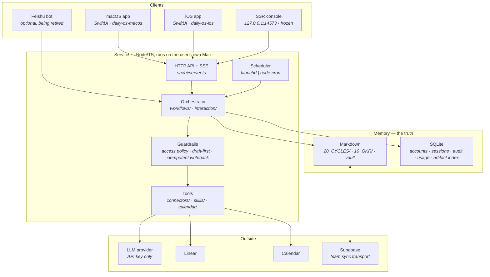

# Architecture

Daily OS is a local-first personal workflow agent. It reads signals you already
produce — issues, calendar, notes — asks an LLM to turn them into a plan or a
retrospective, and writes the result back into markdown files you own.

The design constraint that shapes everything below: **the source of truth is
plain markdown on the user's disk**, not a database and not a server. Every
other decision falls out of that.

---

## System



**Read the arrows into `files` as the point of the system.** A workflow's output
is not a row and not a chat log — it is a section of a markdown file the user
can open in any editor, diff in git, and keep after this software is gone.

---

## Why the service runs on your machine

It is not a deployment preference; three things make it structural.

1. **The files are local.** Cycles, OKRs and the vault live on the user's disk.
   A hosted service would have to ingest the whole vault to do its job, which
   removes the property the product is built on.
2. **Skills spawn local CLIs.** The skill runner executes from
   `~/.claude/skills` or `~/.codex/skills` under the user's own session.
3. **Scheduling is `launchd`.** The Docker path swaps in `node-cron` behind
   `SchedulerPort`, which exists precisely so the scheduler is not the thing
   that dictates where the service can run.

Consequence: **there is no server to gate.** That is also why every repository
here is public — see the note on that in the README.

---

## The five components

The framing an AI-engineering interview usually reaches for, applied honestly —
including where this system is weak.

| Component | Where it lives | State |
| --- | --- | --- |
| **Orchestrator** | `workflows/`, `interaction/daily-os-command.ts` | Command routing plus a plan → tools → confirm → write sequence. Not yet a general agent loop; multi-step planning is tracked separately. |
| **Tools** | `connectors/` (Linear, Feishu, calendar, vault, Chrome), `skills/` | Each tool is a module with a typed boundary. Skills are external processes, versioned and installable from the UI. |
| **Memory** | `20_CYCLES/`, `10_OKR/`, vault; SQLite for indexes | Files are the truth; SQLite only indexes and holds accounts. Retrieval today is path- and keyword-based; embedding-backed retrieval is not built. |
| **Guardrails** | access policy, draft-first confirmation, idempotent writeback, Supabase RLS, `privacy-scan` | The strongest part, and the one with the most test coverage. Detailed below. |
| **Observability** | run ledger, token and cost accounting per run | Weakest part. Runs, durations, token counts and cost are recorded and surfaced; step-level tracing and a written failure-mode catalogue are not. |

### Guardrails, concretely

Four independent mechanisms, each with regression coverage:

- **Draft-first.** Workflows that write user-visible content produce a draft and
  wait for an explicit confirmation. Nothing reaches a file on one LLM call.
- **A planner rerun never overwrites a hand edit.** Each cycle section records
  who last wrote it. If you edited it, a new planner draft is held beside your
  version for you to merge rather than applied. The alternative destroys the
  only copy.
- **Read-only is enforced twice.** A teammate's cycle is unwritable by a
  server-side assertion *and* by database row-level security. The client not
  rendering the control is presentation, not protection.
- **Owner-only configuration.** Providers, keys and data sources are the
  owner's; other roles get an explanation, not a disabled form.

### What is deliberately not here

- **No agent quality evaluation.** There is no task set and no success-rate
  metric. Correctness is covered by 38 regression suites — including
  `adversarial.test.ts` and `okr-writeback-guardrails.test.ts` — but those
  test *the system around* the model, not the model's output quality. This is
  the honest gap; building an eval harness is the next piece of work.
- **No multi-tenancy.** Single machine, single owner. Full per-user isolation
  was scoped and deferred as something only a hosted product needs.

---

## Verification

```bash
npm run verify
```

Runs, in order: `typecheck` → `build` → `privacy:scan` → `license:check` →
`regression:test` (38 suites).

Two of those are unusual enough to call out:

- **`privacy:scan`** fails the build if personal identifiers reach a tracked
  file. The repository is public and the software's whole subject matter is
  personal data, so this is a gate rather than a convention.
- **`license:check`** allow-lists production dependency licences, so a
  transitive copyleft dependency cannot arrive unnoticed in something intended
  to be distributed.

The Swift clients carry their own check binary. Its most interesting case is a
cross-language one: the pixel identicon is a port of `src/ui/avatar.ts`, and
the check compares the Swift output against values read off the JavaScript
implementation, so an account cannot render one avatar in the browser and a
different one on the Mac.

---

## Repositories

| Repository | Contents |
| --- | --- |
| `daily-os-feishu` | This one. Service, workflows, connectors, SSR console, release pipeline. |
| [`daily-os-macos`](https://github.com/alexli-77/daily-os-macos) | macOS client, plus `DailyOSCore` — the design system and domain model shared with iOS. |
| [`daily-os-ios`](https://github.com/alexli-77/daily-os-ios) | iOS client. Depends on `DailyOSCore`. |

The SSR console and the native clients cover the same eight screens. The console
is frozen for UI polish and kept as the headless / Docker / remote fallback —
the reasoning is in [ADR 0001](adr/0001-ssr-console-scope-and-ui-freeze.md).
